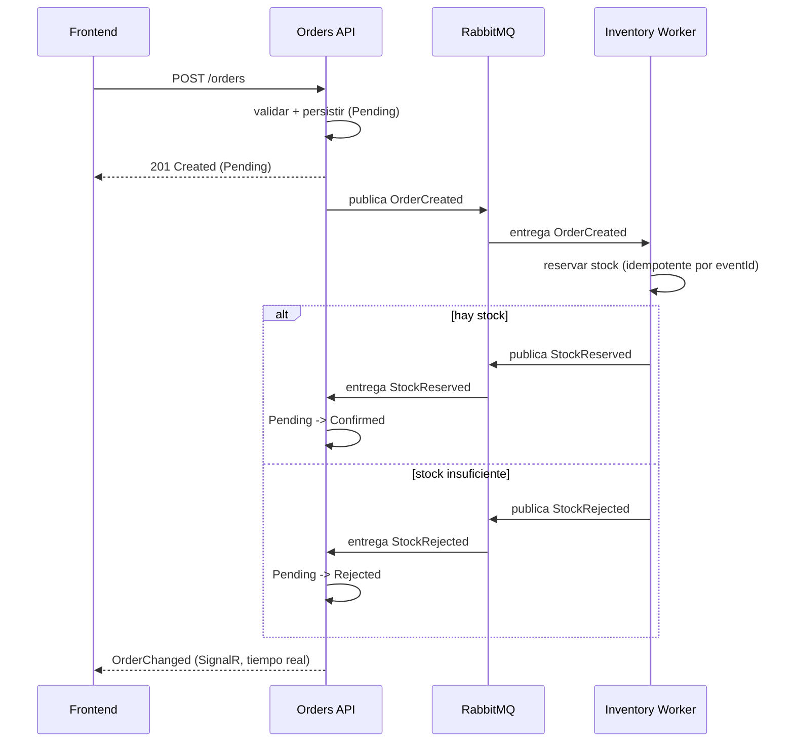

# OrderFlow

[](https://github.com/sanchezlopera96/orderflow/actions/workflows/ci.yml)

Sistema distribuido para una tienda en línea: cada pedido reserva inventario antes de
confirmarse. Los pedidos se crean desde un panel web, la reserva de stock ocurre de forma
asíncrona, y el panel refleja el estado resultante (`Confirmed` o `Rejected`).

Es un monorepo con dos servicios de backend que se comunican **de forma asíncrona sobre
RabbitMQ**, una base de datos PostgreSQL por servicio y un front end en Angular.

> **Inicio rápido:** con Docker instalado, `docker compose up --build` levanta todo el sistema y
> el panel queda en http://localhost:4200. Detalle en [Cómo ejecutar](#cómo-ejecutar).

---

## Tabla de contenido

- [Arquitectura](#arquitectura)
- [Flujo de eventos](#flujo-de-eventos)
- [Stack tecnológico](#stack-tecnológico)
- [Estructura de la solución](#estructura-de-la-solución)
- [Cómo ejecutar](#cómo-ejecutar)
- [Configuración](#configuración)
- [Pruebas](#pruebas)
- [Manejo de fallos](#manejo-de-fallos)
- [Despliegue en Kubernetes](#despliegue-en-kubernetes)
- [Bonus](#bonus)
- [Decisiones de arquitectura (ADR)](#decisiones-de-arquitectura-adr)
- [Roadmap](#roadmap)
- [Qué haría distinto con más tiempo](#qué-haría-distinto-con-más-tiempo)
- [Autor](#autor)
- [Licencia](#licencia)

---

## Arquitectura

Dos servicios de backend, cada uno dueño de sus datos, coordinados mediante integration events:

- **Orders API** — endpoints REST para crear y consultar pedidos. Al crear, valida la entrada,
  persiste el pedido como `Pending` y publica `OrderCreated`. Además es **consumidor**: un
  subscriber en segundo plano escucha los resultados de stock y mueve el pedido a `Confirmed` o
  `Rejected`.
- **Inventory Worker** — un background service que consume `OrderCreated`, intenta reservar
  stock y publica `StockReserved` o `StockRejected`. Las entregas duplicadas se ignoran mediante
  un inbox indexado por el id del evento.

El diseño favorece deliberadamente una forma **Clean Architecture "lite"** (tres proyectos por
servicio) frente a un único proyecto con carpetas y frente a un stack completo de cuatro capas.
Es la cantidad de estructura que el problema justifica, ni más ni menos. Ver
[ADR 0002](docs/adr/0002-clean-architecture-lite.md).

## Flujo de eventos



## Stack tecnológico

| Capa | Tecnología |
| --- | --- |
| Backend | .NET 10, ASP.NET Core Minimal APIs, Worker Service |
| Mensajería | RabbitMQ (cliente nativo `RabbitMQ.Client`) |
| Persistencia | PostgreSQL, Entity Framework Core (una base de datos por servicio) |
| Validación | FluentValidation |
| Front end | Angular 20 (standalone components, signals, reactive forms) |
| Tiempo real | SignalR (con polling de respaldo) |
| Pruebas | xUnit, FluentAssertions, coverlet, Testcontainers |
| Runtime | Docker, Docker Compose |
| Orquestación | Kubernetes (manifiestos), nginx (frontend) |

## Estructura de la solución

```
OrderFlow.sln
├── src/
│   ├── BuildingBlocks/              # Integration events, IEventPublisher, Result pattern
│   ├── Orders/
│   │   ├── Orders.Domain/           # Agregado Order + OrderStatus (sin dependencias externas)
│   │   ├── Orders.Infrastructure/   # EF Core, persistencia, consumer de mensajería
│   │   └── Orders.Api/              # Minimal API, composition root
│   └── Inventory/
│       ├── Inventory.Domain/        # Agregado StockItem + entidad del inbox
│       ├── Inventory.Infrastructure/
│       └── Inventory.Worker/        # BackgroundService consumidor, composition root
├── tests/
│   ├── Orders.Tests/
│   └── Inventory.Tests/
├── frontend/                        # Panel en Angular 20 (nginx en producción)
├── k8s/                             # Manifiestos de Kubernetes
├── docs/adr/                        # Architecture Decision Records
├── docker-compose.yml               # Levanta todo el sistema con un comando
├── Directory.Build.props            # Configuración común (net10.0, nullable, warnings-as-errors)
└── Directory.Packages.props         # Gestión centralizada de versiones de paquetes
```

Las dependencias siempre apuntan hacia adentro, hacia el dominio. Los proyectos de dominio no
referencian nada.

## Cómo ejecutar

### Con Docker (recomendado)

Un solo comando levanta **todo** el sistema —RabbitMQ, las dos bases PostgreSQL, la Orders API, el
Inventory Worker y el panel—, aplica las migraciones y siembra los datos:

```bash
docker compose up --build
```

Los healthchecks y `depends_on` aseguran el orden de arranque (las bases y el broker quedan
saludables antes de que arranquen los servicios). Cuando esté arriba:

- Panel: http://localhost:4200
- API directa (p. ej. para `Orders.Api.http`): http://localhost:5080
- Consola de RabbitMQ (opcional): http://localhost:15672 (guest/guest)

Para detener y borrar todo, incluidos los datos: `docker compose down -v`.

### En local, sin Docker

> Alternativa para desarrollo. Requisitos: .NET 10 SDK (y `dotnet-ef` para las migraciones),
> Node 20+, y un PostgreSQL y un RabbitMQ accesibles.

### Compilar y probar

```bash
dotnet build
dotnet test
```

### Generar las migraciones iniciales

La primera vez, crea las migraciones de EF Core (incluyen los seeds de catálogo y de stock):

```bash
dotnet tool install --global dotnet-ef   # solo si no la tienes

dotnet ef migrations add InitialCreate \
  --project src/Orders/Orders.Infrastructure \
  --startup-project src/Orders/Orders.Api \
  --output-dir Persistence/Migrations

dotnet ef migrations add InitialCreate \
  --project src/Inventory/Inventory.Infrastructure \
  --startup-project src/Inventory/Inventory.Worker \
  --output-dir Persistence/Migrations
```

### Levantar la Orders API

Necesita un PostgreSQL. Uno rápido para desarrollo:

```bash
docker run --name orderflow-postgres -e POSTGRES_PASSWORD=postgres \
  -e POSTGRES_DB=orders -p 5432:5432 -d postgres:16-alpine

docker run --name orderflow-rabbitmq -p 5672:5672 -p 15672:15672 \
  -d rabbitmq:3-management   # consola de administración en http://localhost:15672 (guest/guest)

dotnet run --project src/Orders/Orders.Api
```

La API aplica las migraciones al arrancar (crea las tablas y siembra el catálogo) y publica
`OrderCreated` al crear un pedido. Si el broker no está disponible en ese momento, el pedido se
crea igual y queda en `Pending`. El evento no se pierde: se guarda en el **outbox** en la misma
transacción que el pedido y el despachador lo publica cuando el broker vuelve. Endpoints:

| Método | Ruta | Descripción |
| --- | --- | --- |
| `POST` | `/orders` | Crea un pedido (`201`, o `400` si los datos son inválidos) |
| `GET` | `/orders` | Lista los pedidos con su estado |
| `GET` | `/orders/{id}` | Detalle de un pedido (`404` si no existe) |
| `GET` | `/products` | Lista el catálogo de productos |
| `GET` | `/health` | Liveness |

En `Development` el documento OpenAPI queda en `/openapi/v1.json`. El archivo
`src/Orders/Orders.Api/Orders.Api.http` trae peticiones de ejemplo (válidas y de error) para
ejecutar desde el IDE.

### Levantar el Inventory Worker

En otra terminal (cada servicio usa su propia base `Database__ConnectionString`; en dev el worker
apunta a la base `inventory`):

```bash
docker run --name orderflow-inventory-db -e POSTGRES_PASSWORD=postgres \
  -e POSTGRES_DB=inventory -p 5433:5432 -d postgres:16-alpine   # base separada para Inventory

$env:Database__ConnectionString="Host=localhost;Port=5433;Database=inventory;Username=postgres;Password=postgres"
dotnet run --project src/Inventory/Inventory.Worker
```

El worker consume `OrderCreated`, reserva stock de forma **idempotente** (inbox por `EventId` +
concurrencia optimista (columna de versión)) y publica `StockReserved` o `StockRejected`. El stock sembrado es
`ABC-01=100`, `DEF-02=50`, `GHI-03=3` (este último bajo, para probar el rechazo fácilmente).

> Con ambos servicios arriba el ciclo se cierra de punta a punta: creas un pedido (`Pending`) →
> Inventory reserva → la Orders API consume el resultado y lo pasa a `Confirmed` o `Rejected`, y el
> `GET /orders` refleja el estado final.

### Levantar el panel (frontend)

Panel en Angular 20 (standalone components, signals, reactive forms). Requiere Node 20+ y la Orders
API corriendo (el dev-server hace proxy de `/orders` a `http://localhost:5080`).

```bash
cd frontend
npm install
npm start          # http://localhost:4200
```

El panel tiene dos vistas: un formulario para crear pedidos con validaciones y errores visibles
(incluye el error de negocio cuando el SKU no existe), y una lista que muestra el estado de cada
pedido y se **actualiza en tiempo real por SignalR** (con un polling de respaldo cada 10 s por
resiliencia): se ve pasar de `Pending` a `Confirmed`/`Rejected` al instante. Pruebas del frontend
(opcionales): `npm test` (requiere Chrome).

## Configuración

Todas las connection strings y la configuración del broker se inyectan por **variables de
entorno** (enlazadas con `IOptions`); nada está hardcodeado en el código. Se usa el separador `__`
de .NET para las secciones anidadas.

| Variable | Servicio | Descripción | Valor por defecto (dev) |
| --- | --- | --- | --- |
| `Database__ConnectionString` | Orders API | Connection string de PostgreSQL | `Host=localhost;...;Database=orders` |
| `RabbitMq__HostName` | Orders API | Host del broker | `localhost` |
| `RabbitMq__Port` | Orders API | Puerto AMQP | `5672` |
| `RabbitMq__UserName` | Orders API | Usuario | `guest` |
| `RabbitMq__Password` | Orders API | Contraseña | `guest` |
| `RabbitMq__ExchangeName` | Orders API | Topic exchange | `orderflow` |

La topología es un topic exchange durable `orderflow` con routing keys `order.created`,
`stock.reserved` y `stock.rejected`. Los mensajes se publican como persistentes y la conexión
tiene recuperación automática. Cada consumidor declara su propia cola durable: `inventory.order-created`
(Inventory) y `orders.stock-results` (Orders). El worker toma la misma configuración con la clave
`Database__ConnectionString` apuntando a su propia base.

## Pruebas

Las pruebas de backend (xUnit + FluentAssertions) apuntan a la lógica crítica y corren con un solo
comando, sin necesidad de base de datos ni broker:

```bash
dotnet test
```

Cubren:

- **Validación** de la creación de pedidos (`clienteNombre` no vacío, SKU obligatorio, cantidad 1–100).
- **Máquina de estados** del pedido: `Pending → Confirmed/Rejected`, transiciones ilegales e idempotencia por estado.
- **Idempotencia del consumidor**: procesar el mismo `OrderCreated` dos veces descuenta stock una sola vez.
- **Reserva de stock**: reserva exitosa, stock insuficiente y SKU inexistente.
- **Contrato de mensajería**: serialización de eventos (camelCase) y routing keys.

Las pruebas del frontend (Angular, opcionales) verifican el contrato HTTP del servicio y la
validación del formulario:

```bash
cd frontend && npm test    # requiere Chrome
```

### Pruebas de integración (Testcontainers)

Verifican el comportamiento contra **infraestructura real** levantada en contenedores durante la
ejecución (requieren Docker corriendo):

- **PostgreSQL real** — idempotencia con la restricción de unicidad del inbox (incluida la carrera
  de un mismo evento en paralelo) y **concurrencia optimista** sobre el mismo SKU sin lost updates;
  cosas que el proveedor en memoria no puede reproducir.
- **RabbitMQ real** — round-trip completo: el publisher publica un `OrderCreated` y un consumidor lo
  recibe desde el topic exchange.

Están marcadas con el trait `Integration`, así que el `dotnet test` de arriba (unitarias) no las
necesita. Para correr solo las de integración (con Docker):

```bash
dotnet test --filter Category=Integration
```

O, al revés, solo las unitarias (sin Docker): `dotnet test --filter Category!=Integration`.

En cada push y pull request a `main`, **GitHub Actions** compila y corre todo automáticamente:
las pruebas unitarias, las de integración (Testcontainers levanta PostgreSQL y RabbitMQ reales en
el runner) y el build del frontend. La configuración está en [`.github/workflows/ci.yml`](.github/workflows/ci.yml).

## Manejo de fallos

- **Inventory caído o lento.** El pedido queda en `Pending`. `OrderCreated` espera en la cola
  durable y se procesa cuando el worker se recupera; la entrega at-least-once más el consumidor
  idempotente hacen que reprocesar sea seguro. Sin pérdida de mensajes.
- **Broker caído cuando Orders publica.** Es el problema de dual-write, resuelto con un
  **outbox transaccional**: el evento `OrderCreated` se guarda en la tabla `outbox_messages` en la
  **misma transacción** que el pedido, y un despachador (`OutboxDispatcher`) lo publica después con
  reintentos. Así el evento nunca se pierde, aunque el broker esté caído al crear el pedido — ver
  [ADR 0007](docs/adr/0007-transactional-outbox.md).
- **Entrega duplicada** (at-least-once). El consumidor de Inventory mantiene un **inbox** por
  `EventId`; el descuento de stock y el registro del evento se guardan en una misma transacción, así
  que un evento repetido nunca descuenta dos veces. Se puede demostrar reenviando el mismo mensaje
  desde la consola de RabbitMQ: el log muestra `Evento ... ya procesado; se ignora`.
- **Resultado de stock duplicado o fuera de orden** llegando a Orders. Lo absorbe la máquina de
  estados: un resultado se aplica solo mientras el pedido está en `Pending`; una transición ilegal
  se registra y se ignora.
- **Concurrencia sobre el mismo SKU.** Dos mensajes que reservan el mismo producto a la vez se
  resuelven con concurrencia optimista (columna de versión): uno falla y el consumidor reintenta
  recargando el stock.
- **Mensaje veneno** (no deserializa). Se descarta con `nack` sin requeue para no bloquear la cola;
  un fallo transitorio, en cambio, se reencola (`nack` con requeue) para reintentarlo.

## Despliegue en Kubernetes

La carpeta [`k8s/`](k8s/) trae los manifiestos para desplegar el sistema completo —los dos
servicios, el broker y las dos bases— con `Deployment` + `Service` + `ConfigMap` + `Secret` + `PVC`,
`liveness`/`readiness` probes y límites de recursos. La Orders API y el frontend usan probes
`httpGet` (la API contra el `/health` real, que chequea PostgreSQL y RabbitMQ).

No se necesita un clúster para evaluar el diseño; para probarlo en local (minikube, kind o Docker
Desktop):

```bash
# 1) construir las imágenes (ver k8s/README.md para cargarlas al clúster)
docker build -t orderflow-orders-api:latest       -f src/Orders/Orders.Api/Dockerfile .
docker build -t orderflow-inventory-worker:latest -f src/Inventory/Inventory.Worker/Dockerfile .
docker build -t orderflow-frontend:latest         ./frontend

# 2) aplicar y acceder
kubectl apply -f k8s/
kubectl -n orderflow port-forward svc/frontend 4200:80   # http://localhost:4200
```

Detalle y notas de diseño en [`k8s/README.md`](k8s/README.md).

## Bonus

- **.NET 10** — backend idiomático en la plataforma principal de la empresa.
- **Docker** — `docker compose up` levanta todo con un comando (requisito obligatorio, pero también
  con imágenes multi-stage livianas).
- **Kubernetes** — manifiestos del despliegue completo con probes y límites (ver arriba).
- **Tiempo real** — el panel se actualiza por **SignalR** (push instantáneo) en lugar de solo
  polling, con un polling de respaldo de 10 s por resiliencia.

## Decisiones de arquitectura (ADR)

| # | Decisión |
| --- | --- |
| [0001](docs/adr/0001-record-architecture-decisions.md) | Registrar las decisiones de arquitectura |
| [0002](docs/adr/0002-clean-architecture-lite.md) | Clean Architecture "lite": tres proyectos por servicio |
| [0003](docs/adr/0003-rabbitmq-native-client.md) | RabbitMQ con el cliente nativo en vez de MassTransit |
| [0004](docs/adr/0004-database-per-service.md) | Una base de datos PostgreSQL por servicio |
| [0005](docs/adr/0005-idempotent-consumer-inbox.md) | Consumidor idempotente mediante el inbox pattern |
| [0006](docs/adr/0006-github-flow.md) | GitHub Flow en vez de Git Flow completo |
| [0007](docs/adr/0007-transactional-outbox.md) | Outbox transaccional para publicar de forma confiable |

## Roadmap

La construcción se divide en etapas que se pueden probar de forma independiente:

1. **Esqueleto de la solución y building blocks** — proyectos, contratos compartidos, Result pattern. ✅
2. **Núcleo de Orders** — dominio, persistencia, endpoints `POST`/`GET`, validación. ✅
3. **Mensajería** — publisher de RabbitMQ y topología. ✅
4. **Inventory Worker** — consumidor, reserva atómica de stock, inbox de idempotencia. ✅
5. **Consumidor de Orders** — reacciona a los resultados de stock, aplica las transiciones de estado. ✅
6. **Front end** — panel en Angular (formulario + lista con polling). ✅
7. **Docker** — imágenes multi-stage y `docker compose up`. ✅
8. **Cierre** — README final, tiempo real con SignalR y manifiestos de Kubernetes. ✅
9. **Mejoras adicionales** — outbox transaccional, tests de integración con Testcontainers, CI en GitHub Actions y endpoint de catálogo. ✅

## Qué haría distinto con más tiempo

- **Dead-letter queue** con reintentos acotados (backoff) para los mensajes que fallan de forma
  persistente, en lugar de reencolar indefinidamente.
- **Observabilidad**: logging estructurado con correlación por `EventId`/`OrderId` y trazas con
  OpenTelemetry a través de los saltos de mensajería.
- **Publicación de imágenes** a un registro y un `HorizontalPodAutoscaler` en Kubernetes.
- Un diseño de **reserva en dos fases** (reservar y confirmar por separado) si el negocio lo requiriera.

## Autor

**Santiago Sanchez Lopera** — [github.com/sanchezlopera96](https://github.com/sanchezlopera96)

## Licencia

Publicado bajo la [Licencia MIT](LICENSE).
