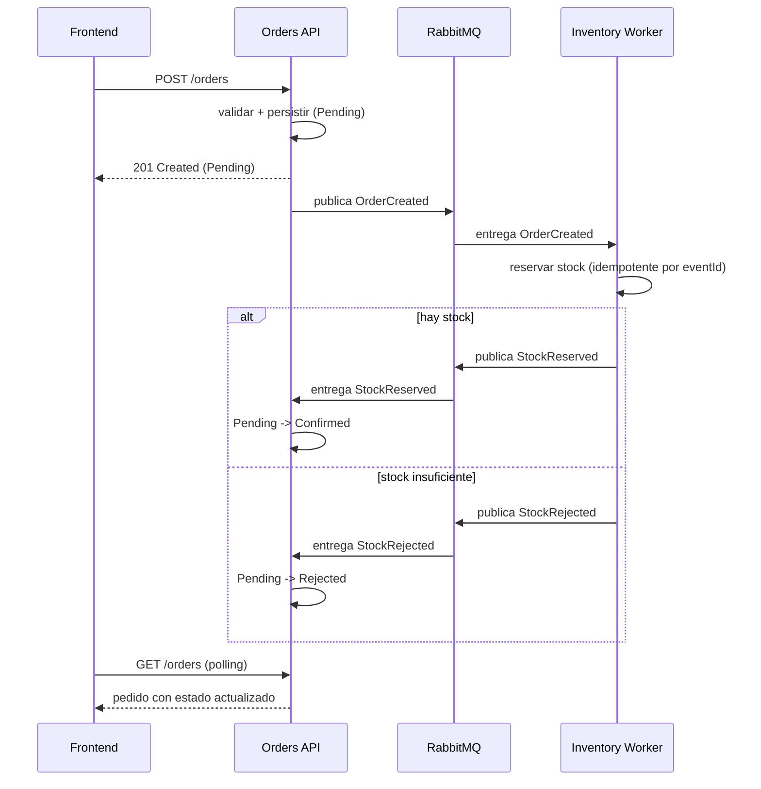

# OrderFlow

Sistema distribuido para una tienda en línea: cada pedido reserva inventario antes de
confirmarse. Los pedidos se crean desde un panel web, la reserva de stock ocurre de forma
asíncrona, y el panel refleja el estado resultante (`Confirmed` o `Rejected`).

Es un monorepo con dos servicios de backend que se comunican **de forma asíncrona sobre
RabbitMQ**, una base de datos PostgreSQL por servicio y un front end en Angular.

> **Estado del proyecto.** La solución se construye por etapas independientes que siempre
> compilan (ver [Roadmap](#roadmap)). Este documento crece en cada etapa; la experiencia de
> `docker compose up` con un solo comando llega en la etapa de Docker.

---

## Tabla de contenido

- [Arquitectura](#arquitectura)
- [Flujo de eventos](#flujo-de-eventos)
- [Stack tecnológico](#stack-tecnológico)
- [Estructura de la solución](#estructura-de-la-solución)
- [Cómo ejecutar](#cómo-ejecutar)
- [Configuración](#configuración)
- [Pruebas](#pruebas)
- [Manejo de fallos](#manejo-de-fallos)
- [Decisiones de arquitectura (ADR)](#decisiones-de-arquitectura-adr)
- [Roadmap](#roadmap)
- [Qué haría distinto con más tiempo](#qué-haría-distinto-con-más-tiempo)
- [Autor](#autor)
- [Licencia](#licencia)

---

## Arquitectura

Dos servicios de backend, cada uno dueño de sus datos, coordinados mediante integration events:

- **Orders API** — endpoints REST para crear y consultar pedidos. Al crear, valida la entrada,
  persiste el pedido como `Pending` y publica `OrderCreated`. Además es **consumidor**: un
  subscriber en segundo plano escucha los resultados de stock y mueve el pedido a `Confirmed` o
  `Rejected`.
- **Inventory Worker** — un background service que consume `OrderCreated`, intenta reservar
  stock y publica `StockReserved` o `StockRejected`. Las entregas duplicadas se ignoran mediante
  un inbox indexado por el id del evento.

El diseño favorece deliberadamente una forma **Clean Architecture "lite"** (tres proyectos por
servicio) frente a un único proyecto con carpetas y frente a un stack completo de cuatro capas.
Es la cantidad de estructura que el problema justifica, ni más ni menos. Ver
[ADR 0002](docs/adr/0002-clean-architecture-lite.md).

## Flujo de eventos



## Stack tecnológico

| Capa | Tecnología |
| --- | --- |
| Backend | .NET 10, ASP.NET Core Minimal APIs, Worker Service |
| Mensajería | RabbitMQ (cliente nativo `RabbitMQ.Client`) |
| Persistencia | PostgreSQL, Entity Framework Core (una base de datos por servicio) |
| Validación | FluentValidation |
| Front end | Angular 20 (standalone components, signals, reactive forms) |
| Pruebas | xUnit, FluentAssertions, coverlet |
| Runtime | Docker, Docker Compose |

## Estructura de la solución

```
OrderFlow.sln
├── src/
│   ├── BuildingBlocks/              # Integration events, IEventPublisher, Result pattern
│   ├── Orders/
│   │   ├── Orders.Domain/           # Agregado Order + OrderStatus (sin dependencias externas)
│   │   ├── Orders.Infrastructure/   # EF Core, persistencia, consumer de mensajería
│   │   └── Orders.Api/              # Minimal API, composition root
│   └── Inventory/
│       ├── Inventory.Domain/        # Agregado StockItem + entidad del inbox
│       ├── Inventory.Infrastructure/
│       └── Inventory.Worker/        # BackgroundService consumidor, composition root
├── tests/
│   ├── Orders.Tests/
│   └── Inventory.Tests/
├── docs/adr/                        # Architecture Decision Records
├── Directory.Build.props            # Configuración común (net10.0, nullable, warnings-as-errors)
└── Directory.Packages.props         # Gestión centralizada de versiones de paquetes
```

Las dependencias siempre apuntan hacia adentro, hacia el dominio. Los proyectos de dominio no
referencian nada.

## Cómo ejecutar

> El arranque completo en contenedores (`docker compose up`) se entrega en una etapa posterior.
> Por ahora la solución compila, las pruebas corren sin base de datos y la Orders API se puede
> levantar contra un PostgreSQL local.

Requisitos: .NET 10 SDK (y la herramienta `dotnet-ef` para las migraciones).

### Compilar y probar

```bash
dotnet build
dotnet test
```

### Generar las migraciones iniciales

La primera vez, crea las migraciones de EF Core (incluyen los seeds de catálogo y de stock):

```bash
dotnet tool install --global dotnet-ef   # solo si no la tienes

dotnet ef migrations add InitialCreate \
  --project src/Orders/Orders.Infrastructure \
  --startup-project src/Orders/Orders.Api \
  --output-dir Persistence/Migrations

dotnet ef migrations add InitialCreate \
  --project src/Inventory/Inventory.Infrastructure \
  --startup-project src/Inventory/Inventory.Worker \
  --output-dir Persistence/Migrations
```

### Levantar la Orders API

Necesita un PostgreSQL. Uno rápido para desarrollo:

```bash
docker run --name orderflow-postgres -e POSTGRES_PASSWORD=postgres \
  -e POSTGRES_DB=orders -p 5432:5432 -d postgres:16-alpine

docker run --name orderflow-rabbitmq -p 5672:5672 -p 15672:15672 \
  -d rabbitmq:3-management   # consola de administración en http://localhost:15672 (guest/guest)

dotnet run --project src/Orders/Orders.Api
```

La API aplica las migraciones al arrancar (crea las tablas y siembra el catálogo) y publica
`OrderCreated` al crear un pedido. Si el broker no está disponible en ese momento, el pedido se
crea igual y queda en `Pending` (el fallo se registra); un outbox transaccional sería la evolución
robusta. Endpoints:

| Método | Ruta | Descripción |
| --- | --- | --- |
| `POST` | `/orders` | Crea un pedido (`201`, o `400` si los datos son inválidos) |
| `GET` | `/orders` | Lista los pedidos con su estado |
| `GET` | `/orders/{id}` | Detalle de un pedido (`404` si no existe) |
| `GET` | `/health` | Liveness |

En `Development` el documento OpenAPI queda en `/openapi/v1.json`. El archivo
`src/Orders/Orders.Api/Orders.Api.http` trae peticiones de ejemplo (válidas y de error) para
ejecutar desde el IDE.

### Levantar el Inventory Worker

En otra terminal (cada servicio usa su propia base `Database__ConnectionString`; en dev el worker
apunta a la base `inventory`):

```bash
docker run --name orderflow-inventory-db -e POSTGRES_PASSWORD=postgres \
  -e POSTGRES_DB=inventory -p 5433:5432 -d postgres:16-alpine   # base separada para Inventory

$env:Database__ConnectionString="Host=localhost;Port=5433;Database=inventory;Username=postgres;Password=postgres"
dotnet run --project src/Inventory/Inventory.Worker
```

El worker consume `OrderCreated`, reserva stock de forma **idempotente** (inbox por `EventId` +
concurrencia optimista (columna de versión)) y publica `StockReserved` o `StockRejected`. El stock sembrado es
`ABC-01=100`, `DEF-02=50`, `GHI-03=3` (este último bajo, para probar el rechazo fácilmente).

> En esta etapa, quien reacciona a `StockReserved`/`StockRejected` para pasar el pedido a
> `Confirmed`/`Rejected` (el consumidor en la Orders API) llega en la etapa siguiente.

## Configuración

Todas las connection strings y la configuración del broker se inyectan por **variables de
entorno** (enlazadas con `IOptions`); nada está hardcodeado en el código. Se usa el separador `__`
de .NET para las secciones anidadas.

| Variable | Servicio | Descripción | Valor por defecto (dev) |
| --- | --- | --- | --- |
| `Database__ConnectionString` | Orders API | Connection string de PostgreSQL | `Host=localhost;...;Database=orders` |
| `RabbitMq__HostName` | Orders API | Host del broker | `localhost` |
| `RabbitMq__Port` | Orders API | Puerto AMQP | `5672` |
| `RabbitMq__UserName` | Orders API | Usuario | `guest` |
| `RabbitMq__Password` | Orders API | Contraseña | `guest` |
| `RabbitMq__ExchangeName` | Orders API | Topic exchange | `orderflow` |

La topología es un topic exchange durable `orderflow` con routing keys `order.created`,
`stock.reserved` y `stock.rejected`. Los mensajes se publican como persistentes y la conexión
tiene recuperación automática. Las colas y sus bindings las declara cada consumidor (Inventory y
Orders) en las etapas siguientes.

## Pruebas

Las pruebas apuntan a la lógica crítica: validación de entrada, transiciones de estado del pedido
e idempotencia del consumidor. Corren con un solo comando:

```bash
dotnet test
```

Las pruebas del front end (Angular) se agregan junto con el front end.

## Manejo de fallos

Los dos escenarios de fallo exigidos se abordan así (se amplían en etapas posteriores):

- **Inventory caído o lento.** El pedido queda en `Pending`. `OrderCreated` espera en la cola
  durable y se procesa cuando el worker se recupera; la entrega at-least-once más el consumidor
  idempotente hacen que reprocesar sea seguro.
- **Broker caído cuando Orders publica.** Es el problema de dual-write. El manejo pragmático es
  recuperación automática de conexión más exponer el fallo; la evolución robusta es un
  transactional outbox, documentado en
  [ADR 0005](docs/adr/0005-idempotent-consumer-inbox.md) y en el roadmap.

## Decisiones de arquitectura (ADR)

| # | Decisión |
| --- | --- |
| [0001](docs/adr/0001-record-architecture-decisions.md) | Registrar las decisiones de arquitectura |
| [0002](docs/adr/0002-clean-architecture-lite.md) | Clean Architecture "lite": tres proyectos por servicio |
| [0003](docs/adr/0003-rabbitmq-native-client.md) | RabbitMQ con el cliente nativo en vez de MassTransit |
| [0004](docs/adr/0004-database-per-service.md) | Una base de datos PostgreSQL por servicio |
| [0005](docs/adr/0005-idempotent-consumer-inbox.md) | Consumidor idempotente mediante el inbox pattern |
| [0006](docs/adr/0006-github-flow.md) | GitHub Flow en vez de Git Flow completo |

## Roadmap

La construcción se divide en etapas que se pueden probar de forma independiente:

1. **Esqueleto de la solución y building blocks** — proyectos, contratos compartidos, Result pattern. ✅
2. **Núcleo de Orders** — dominio, persistencia, endpoints `POST`/`GET`, validación. ✅
3. **Mensajería** — publisher de RabbitMQ y topología. ✅
4. **Inventory Worker** — consumidor, reserva atómica de stock, inbox de idempotencia. ✅
5. Consumidor de Orders — reacciona a los resultados de stock, aplica las transiciones de estado.
6. Front end — panel en Angular (formulario + lista con polling).
7. Docker — imágenes multi-stage y `docker compose up`.
8. Cierre del README, más manifiestos de Kubernetes y SignalR opcionales.

## Qué haría distinto con más tiempo

Se registra aquí a medida que el proyecto crece (transactional outbox, manejo de dead-letter,
actualización en tiempo real con SignalR, observabilidad más rica).

## Autor

**Santiago Sanchez Lopera** — [github.com/sanchezlopera96](https://github.com/sanchezlopera96)

## Licencia

Publicado bajo la [Licencia MIT](LICENSE).
